 <div align="center">



<a href="https://git.io/typing-svg">
  
</a>

<br/><br/>


<br/><br/>


</div>


## `> whoami`



> 💜 Estou começando minha carreira em tecnologia, com foco em Java. Ainda não tenho projetos grandes, mas estou construindo a base com muito treino e prática.


## `> stack`

<div align="center">


<br/><br/>


</div>


## `> aprendendo_agora`

<div align="center">



</div>

```java
while (estudando) {
    praticar("Java");
    commitar();
    evoluir();
}
```

<div align="center">


</div>


## `> roadmap`

- [ ] 🔹 Dominar a base do Java
- [ ] 🔹 Construir os primeiros projetos
- [ ] 🔹 Montar meu portfólio aqui no GitHub
- [ ] 🎯 Conquistar minha vaga de júnior / jovem aprendiz


## `> projetos`



<div align="center">

<table>
  <tr>
    <td align="center" width="50%">
      <h3>☕ TREINO EM JAVA</h3>
      <p>Exercícios e estudos que estou commitando enquanto aprendo.</p>
      
      <br/><br/>
      <a href="https://github.com/CloudNine-dav/Meu-perfil">
        
      </a>
    </td>
    <td align="center" width="50%">
      <h3>🚧 PRÓXIMO PROJETO</h3>
      <p>Em construção.</p>
      
      <br/><br/>
      
    </td>
  </tr>
</table>

</div>


## `> github_stats`

<div align="center">


<br/>


</div>


## `> snake`

<div align="center">

<picture>
  <source media="(prefers-color-scheme: dark)" srcset="https://raw.githubusercontent.com/CloudNine-dav/Meu-perfil/output/github-snake-dark.svg" />
  
</picture>

</div>


<div align="center">

### 💬 "Todo dev começou com um `Hello, World!`"

</div>


## `> contato`

<div align="center">

<a href="https://instagram.com/davisoares8283">
  
</a>
<a href="https://github.com/CloudNine-dav">
  
</a>

</div>


